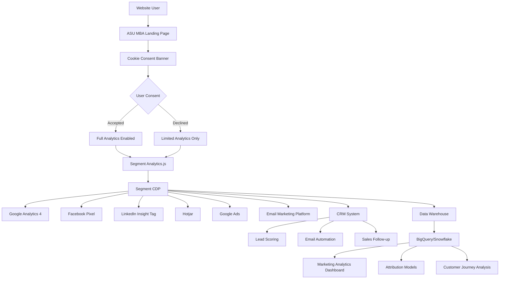

# Customer Data Platform (CDP) Data Flow Architecture
## ASU Marketing Technology Demo - Segment Implementation

---

## Data Flow Overview



---

## Segment Configuration

### 1. Source Configuration
**Source Name**: ASU MBA Website
**Source Type**: JavaScript
**Write Key**: DEMO_SEGMENT_WRITE_KEY

### 2. Destinations Configuration

#### Google Analytics 4
- **Destination Type**: Google Analytics 4
- **Measurement ID**: G-DEMO123456
- **Event Mapping**:
  - `page` → `page_view`
  - `cta_click` → `cta_click`
  - `form_submission` → `form_submission`
  - `scroll_depth` → `scroll_depth`
  - `cookie_consent` → `cookie_consent`

#### Facebook Pixel
- **Destination Type**: Facebook Pixel
- **Pixel ID**: 123456789012345
- **Event Mapping**:
  - `page` → `PageView`
  - `form_submission` → `Lead`
  - `cta_click` → `CustomEvent`

#### LinkedIn Insight Tag
- **Destination Type**: LinkedIn Insight Tag
- **Partner ID**: 123456
- **Event Mapping**:
  - `page` → `PageView`
  - `form_submission` → `Lead`

#### Hotjar
- **Destination Type**: Hotjar
- **Site ID**: 1234567
- **Event Mapping**:
  - `page` → `PageView`
  - `form_submission` → `Conversion`

#### Google Ads
- **Destination Type**: Google Ads
- **Conversion ID**: 123456789
- **Conversion Label**: ABC123DEF456
- **Event Mapping**:
  - `form_submission` → `Conversion`

#### Email Marketing Platform (Mailchimp)
- **Destination Type**: Mailchimp
- **API Key**: DEMO_MAILCHIMP_KEY
- **Event Mapping**:
  - `form_submission` → `Subscribe`
  - `page` → `PageView`

#### CRM System (Salesforce)
- **Destination Type**: Salesforce
- **Instance URL**: https://asu-demo.salesforce.com
- **Event Mapping**:
  - `form_submission` → `Lead Creation`
  - `cta_click` → `Lead Activity`

#### Data Warehouse (BigQuery)
- **Destination Type**: BigQuery
- **Project ID**: asu-marketing-demo
- **Dataset**: marketing_events
- **Event Mapping**: All events stored as raw data

---

## Data Schema

### User Identification
```javascript
// Anonymous User
{
  "anonymousId": "anon_1234567890_abc123",
  "traits": {
    "firstVisit": "2024-01-15T10:00:00.000Z",
    "lastVisit": "2024-01-15T10:30:00.000Z",
    "pageViews": 3,
    "sessionCount": 1
  }
}

// Identified User (after form submission)
{
  "userId": "user_1234567890_def456",
  "traits": {
    "email": "john.doe@example.com",
    "firstName": "John",
    "lastName": "Doe",
    "phone": "+1-555-123-4567",
    "company": "TechCorp",
    "experienceLevel": "3-5",
    "interestArea": "marketing",
    "newsletterOptIn": true,
    "leadSource": "asu_mba_landing_page",
    "leadScore": 85,
    "firstVisit": "2024-01-15T10:00:00.000Z",
    "lastVisit": "2024-01-15T10:35:00.000Z"
  }
}
```

### Event Schema

#### Page View Event
```javascript
{
  "event": "page",
  "properties": {
    "url": "https://asu.edu/mba-demo",
    "title": "ASU Online MBA Program - Marketing Technology Demo",
    "referrer": "https://google.com",
    "search": "asu online mba",
    "path": "/mba-demo",
    "hash": "",
    "url": "https://asu.edu/mba-demo",
    "name": "ASU MBA Landing Page"
  },
  "context": {
    "page": {
      "url": "https://asu.edu/mba-demo",
      "title": "ASU Online MBA Program - Marketing Technology Demo",
      "referrer": "https://google.com"
    },
    "userAgent": "Mozilla/5.0...",
    "locale": "en-US",
    "timezone": "America/Phoenix",
    "campaign": {
      "source": "google",
      "medium": "cpc",
      "name": "asu_mba_2024",
      "term": "online mba programs"
    }
  }
}
```

#### CTA Click Event
```javascript
{
  "event": "cta_click",
  "properties": {
    "buttonType": "primary",
    "buttonPosition": "top",
    "pageSection": "hero",
    "buttonText": "Request Information",
    "trackingId": "hero_cta"
  },
  "context": {
    "page": {
      "url": "https://asu.edu/mba-demo",
      "title": "ASU Online MBA Program - Marketing Technology Demo"
    }
  }
}
```

#### Form Submission Event
```javascript
{
  "event": "form_submission",
  "properties": {
    "formId": "contact_form",
    "formFields": 7,
    "hasEmail": true,
    "hasPhone": true,
    "interestArea": "marketing",
    "experienceLevel": "3-5",
    "newsletterOptIn": true,
    "company": "TechCorp",
    "leadValue": 5000
  },
  "traits": {
    "email": "john.doe@example.com",
    "firstName": "John",
    "lastName": "Doe",
    "phone": "+1-555-123-4567",
    "company": "TechCorp",
    "experienceLevel": "3-5",
    "interestArea": "marketing",
    "newsletterOptIn": true
  }
}
```

#### Scroll Depth Event
```javascript
{
  "event": "scroll_depth",
  "properties": {
    "scrollPercentage": 50,
    "pageUrl": "https://asu.edu/mba-demo",
    "timeOnPage": 120
  }
}
```

#### Cookie Consent Event
```javascript
{
  "event": "cookie_consent",
  "properties": {
    "consentStatus": "accepted",
    "consentDate": "2024-01-15T10:02:00.000Z",
    "consentVersion": "1.0"
  }
}
```

---

## Consent Management Flow

### 1. Initial Page Load
```javascript
// User visits page
analytics.page('ASU MBA Landing Page', {
  url: 'https://asu.edu/mba-demo',
  referrer: 'https://google.com'
});

// Cookie banner appears after 2 seconds
setTimeout(() => {
  showCookieBanner();
}, 2000);
```

### 2. User Accepts Cookies
```javascript
// User clicks "Accept All"
analytics.track('cookie_consent', {
  consentStatus: 'accepted',
  consentDate: new Date().toISOString(),
  consentVersion: '1.0'
});

// Enable full analytics
enableFullAnalytics();
```

### 3. User Declines Cookies
```javascript
// User clicks "Decline"
analytics.track('cookie_consent', {
  consentStatus: 'declined',
  consentDate: new Date().toISOString(),
  consentVersion: '1.0'
});

// Enable limited analytics only
enableLimitedAnalytics();
```

---

## Data Processing Rules

### 1. Real-time Processing
- **Page Views**: Immediate processing for real-time dashboards
- **Form Submissions**: Instant lead creation in CRM
- **CTA Clicks**: Real-time conversion tracking

### 2. Batch Processing
- **Daily**: User journey analysis
- **Weekly**: Attribution modeling
- **Monthly**: Customer lifetime value calculations

### 3. Data Enrichment
```javascript
// Enrich user data with external sources
analytics.identify('user_123', {
  email: 'john.doe@example.com',
  firstName: 'John',
  lastName: 'Doe',
  // Enriched data from CRM
  leadScore: 85,
  leadStage: 'qualified',
  lastContactDate: '2024-01-15T10:35:00.000Z',
  // Enriched data from marketing automation
  emailOpenRate: 0.75,
  emailClickRate: 0.25,
  // Enriched data from website behavior
  totalPageViews: 15,
  averageSessionDuration: 180,
  conversionRate: 0.08
});
```

---

## Integration Points

### 1. CRM Integration (Salesforce)
```javascript
// Lead creation in Salesforce
analytics.track('form_submission', {
  formId: 'contact_form',
  leadSource: 'asu_mba_landing_page',
  campaignName: 'asu_mba_2024',
  leadScore: calculateLeadScore(userData)
});

// Segment automatically creates lead in Salesforce
// with all form data and behavioral insights
```

### 2. Email Marketing Integration (Mailchimp)
```javascript
// Add user to email list
analytics.identify('user_123', {
  email: 'john.doe@example.com',
  firstName: 'John',
  lastName: 'Doe',
  interestArea: 'marketing',
  experienceLevel: '3-5',
  newsletterOptIn: true
});

// Segment automatically adds to Mailchimp list
// and triggers welcome email sequence
```

### 3. Data Warehouse Integration (BigQuery)
```sql
-- Raw event data stored in BigQuery
CREATE TABLE `asu-marketing-demo.marketing_events.user_events` (
  event_id STRING,
  user_id STRING,
  anonymous_id STRING,
  event_name STRING,
  event_properties JSON,
  user_properties JSON,
  timestamp TIMESTAMP,
  session_id STRING,
  page_url STRING,
  referrer STRING,
  user_agent STRING,
  campaign_source STRING,
  campaign_medium STRING,
  campaign_name STRING
);
```

---

## Privacy & Compliance

### 1. GDPR Compliance
- ✅ Cookie consent management
- ✅ Data minimization
- ✅ User rights (access, deletion, portability)
- ✅ Data retention policies
- ✅ Privacy policy integration

### 2. CCPA Compliance
- ✅ California resident identification
- ✅ Opt-out mechanisms
- ✅ Data disclosure requirements
- ✅ Service provider agreements

### 3. Data Retention
```javascript
// Automatic data deletion after retention period
const RETENTION_PERIODS = {
  userEvents: '2 years',
  userProfiles: '5 years',
  leadData: '7 years',
  analyticsData: '3 years'
};
```

---

## Monitoring & Alerting

### 1. Data Quality Monitoring
- Event volume monitoring
- Data schema validation
- Missing required fields detection
- Duplicate event detection

### 2. Performance Monitoring
- API response times
- Event processing latency
- Destination delivery success rates
- Error rate monitoring

### 3. Business Metrics Monitoring
- Lead conversion rates
- User engagement metrics
- Campaign performance
- ROI calculations

---

## Testing & Validation

### 1. Segment Debug Mode
```javascript
// Enable debug mode for testing
analytics.debug(true);

// Monitor events in real-time
analytics.track('test_event', {
  testProperty: 'test_value'
});
```

### 2. Destination Testing
- Test each destination individually
- Validate event mapping
- Check data transformation
- Verify error handling

### 3. End-to-End Testing
- Complete user journey testing
- Cross-platform data consistency
- Real-time vs batch processing
- Data warehouse accuracy

This CDP implementation demonstrates enterprise-level customer data management with comprehensive tracking, privacy compliance, and integration capabilities suitable for a university marketing technology environment. 